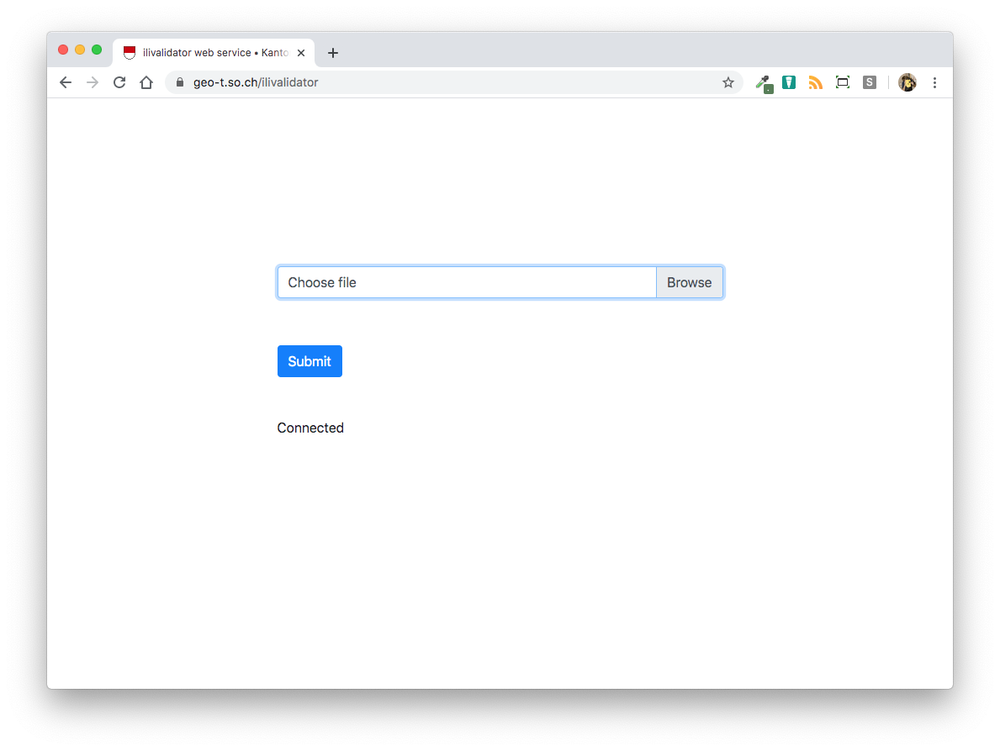
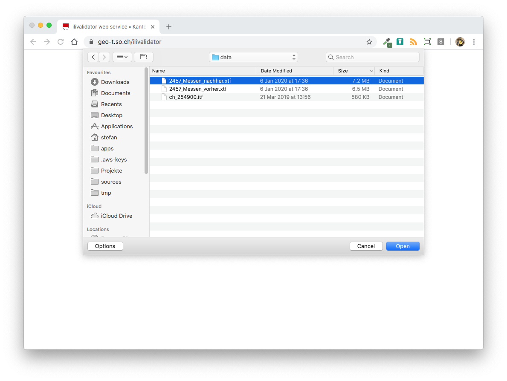
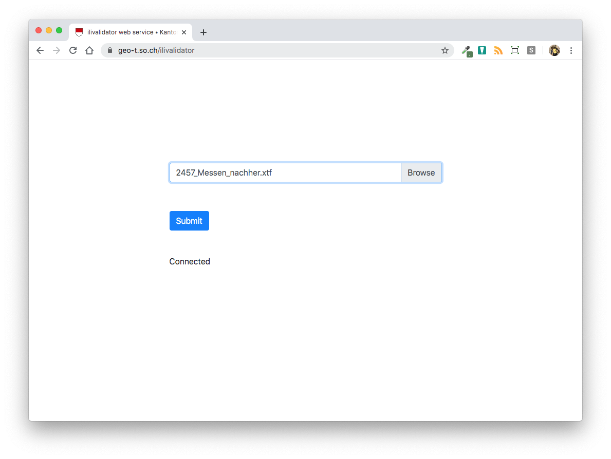
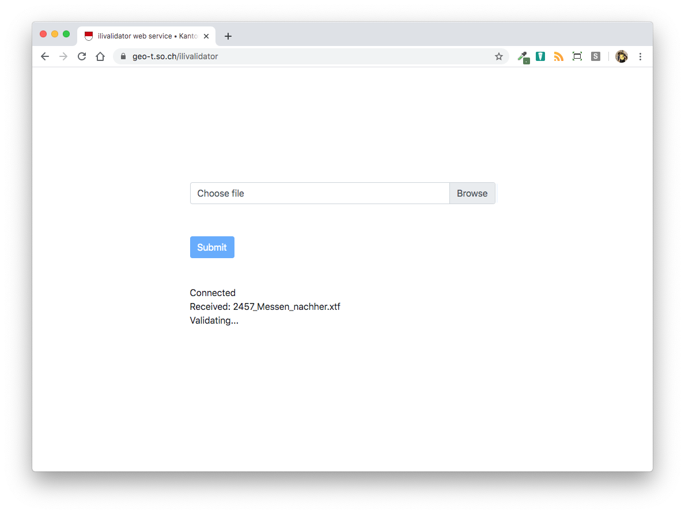
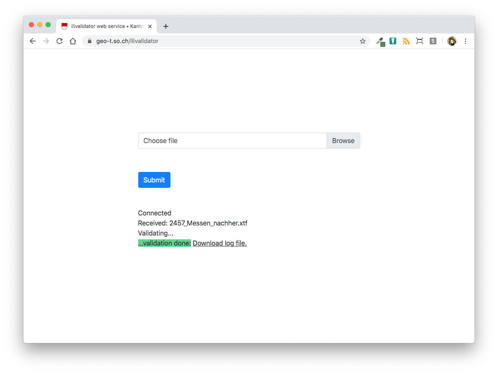
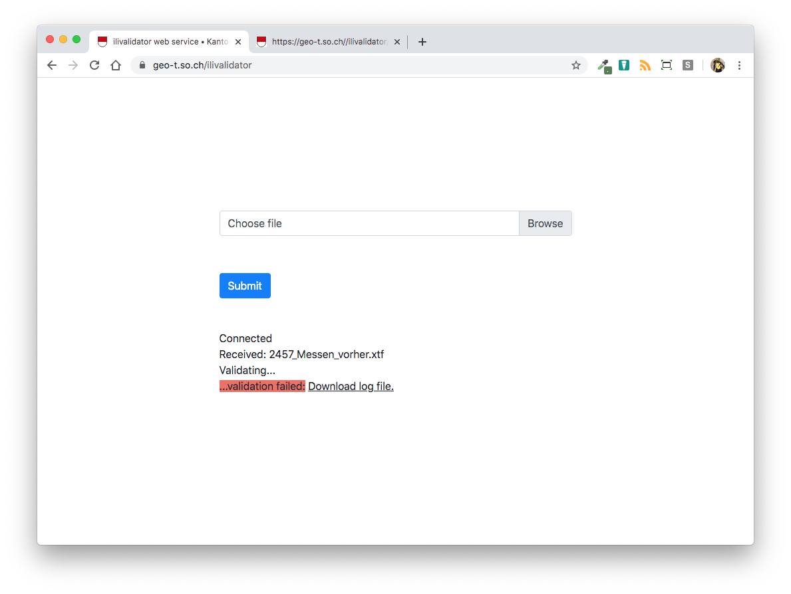
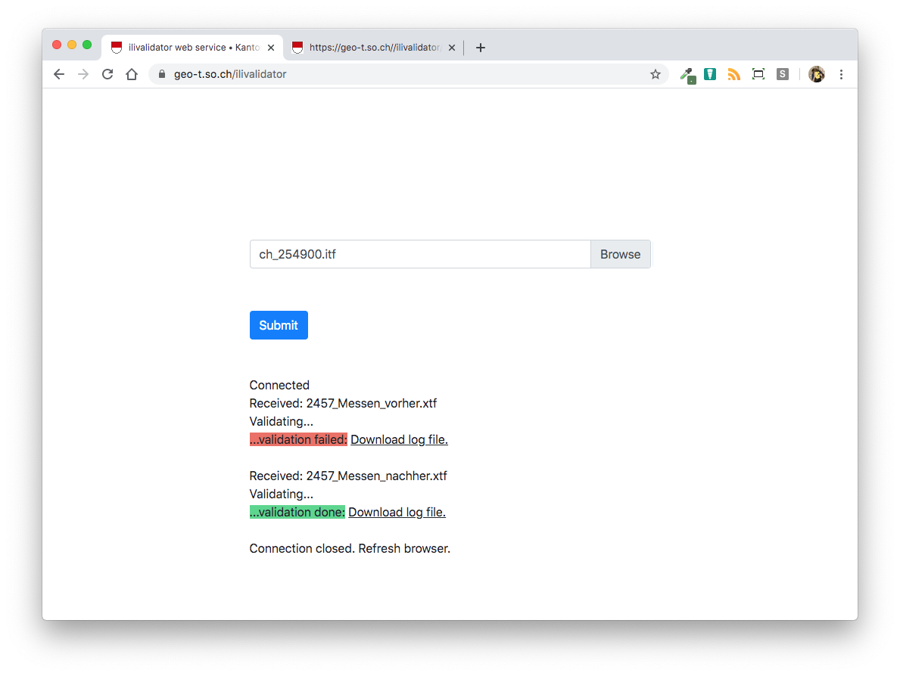

# Benutzerhandbuch

## Bedienung des Webservices

Der *ilivalidator web service* stellt eine einfache Art dar INTERLIS-Daten gegenüber einem INTERLIS-Modell  zu prüfen (= Modellkonformität). Die zu prüfenden INTERLIS-Daten werden mittels Webformular auf einen Server hochgeladen, wo sie anschliessend automatisch geprüft werden. Das Prüfresultat wird direkt im Browser angezeigt. 

Beim Aufruf des *ilivalidator web services* erscheint folgendes Webformular:

Im Browserfenster unter dem "Submit"-Knopf muss zwingend "Connected" stehen. 

Die zu prüfende Datei kann durch Knopfdruck auf "Browse" ausgewählt werden. Die Datei darf *nicht* gezippt sein und höchstens 50 Megabyte gross sein.

Im Feld "Choose file" erscheint neu der Name der ausgewählten Datei.

Die Validierung kann durch Knopfdruck auf "Submit" gestartet werden. Der Knopf wird ausgegraut und es können keine weiteren Aktionen auf der Webseite vorgenommen werden. Im Browserfenster erscheinen die meldungen "Received: <Dateiname>" und "Validating...". 

Die Prüfung kann - je nach Grösse der Datei resp. des Dateiinhaltes - ein paar Sekunden bis zu einigen Minuten dauern. Nach der Prüfung erscheint im Browser je nach Prüfresultat eine unterschiedliche Meldung. War die Prüfung erfolgreich, ist die Meldung "...validation done:" und ein Link zu der Log-Datei:

Wurden bei der Validierung der Datei Fehler gefunden, ist die Meldung "...validation failed:" und ein Link zu der Log-Datei:

Unter gewissen Umständen kann es zu Unterbrüchen zwischen Browser und Validierungsserver kommen. In diesem Fall erscheint bei einer Aktion (z.B. "Submit"-Knopf drücken) die Meldung "Connection closed. Refresh Browser". In diesem Fall muss die Seite neu geladen werden und es sollte wieder die Melung "Connected" erscheinen.

